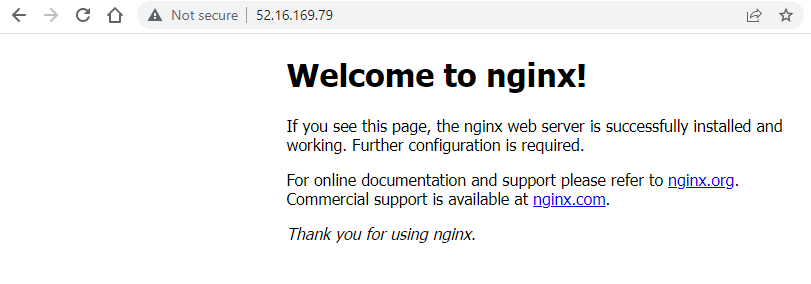

# Autoscaling and Load Balancing

load balancing will check the health of each instance and redirect traffic. It will create more groups up to the maximimum size.

The listener listens for incoming connections. the load balance then forward requests to Target groups HTTP, which have a launch template and ALB. A target could be an EC2 instance, container or other internal service. The aim is to make autoscaling groups in multible available zones. The health check monitors the targets.


The purpose of having multiple zones of availablity is to ensure that data and services will not go down in an emergency or interruption.


## Autoscaling setup

1. go to lauch templates in the EC2 console and click on create launch template
2. name according to naming convention name-tech201-ASG-1
3. tick the box for auto scaling guidance
4. use the ubuntu 18.04 operating system
5. t2 micro instance
6. key pair is devops-tech201
7. Network settings , select existing security group tech201-app
8. Go to advanced details, in user data optional write the following from your provisioning file. The # details are for further steps and can be added later
```
#!/bin/bash
sudo apt update -y
sudo apt upgrade -y

sudo apt install nginx -y
sudo systemctl restart nginx
sudo systemctl enable nginx

#cd app
#nmp install
#npm start
```
9. launch the template

## Running your Autoscaling launch template

1. go to Auto Scaling groups in the EC2 console and click on create launch template
2. name according to naming convention name-tech201-ASG-app
3. default VPC
4. Select DevOpsStudent default 1a , 1b and 1c as the three available zones and subnets
5. configure advanced options, attach to a new load balancer
6. select internet-facing load balancer scheme
7. for default routing select your target group or create if not.
8. For health checks tick ELB and response time of 300
9. now configure group size and scaling policies group size should be 2,2,3 for desired, minimum and maximum
10. add tag of names and value in naming scheme with -SC on the end just for easy recognition
11. finally click next and then create auto scaling group

This should now automatically start two instances with the following when you connect to the public ip




## Setting up our App


