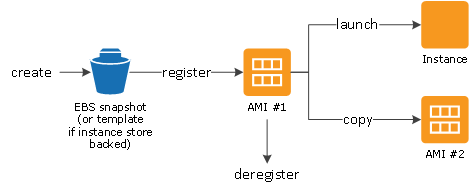

# Creating the AMI

In order to store our app data and leave it in AWS but at a lower cost and innactive, we have to create and AMI before terminating our app instansce. This is because the app instance costs money and computing power even when it is off whereas and AMI can do this more efficiently.By creating this AMI , we can relaunch at a later date.

Firstly we need to navigate to the instances in the EC2 console dashboard and find the instance that we want to create an AMI of. By selecting this instance, there is an option under Actions,Image and templates to create the image.

This should be named with proper naming conventions , that it is an AMI and with the ports necessary for future use.

To find the AMI later got to the AMI images on the left in the AWS website.