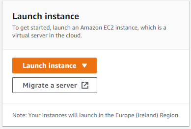
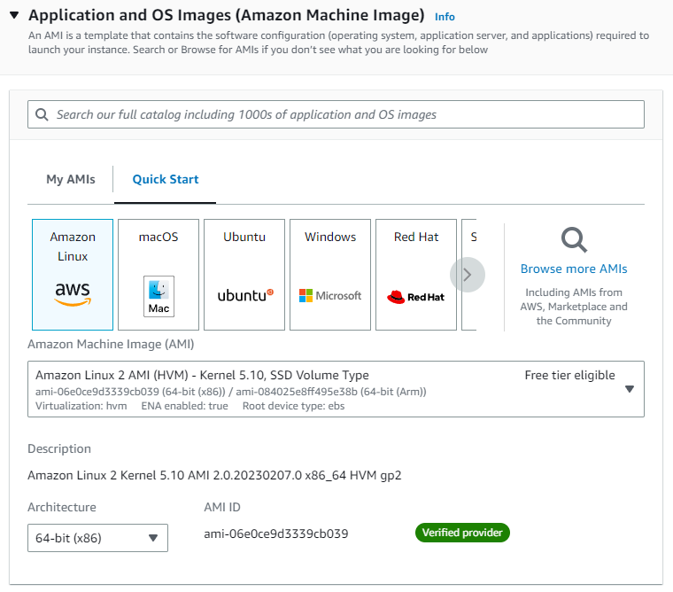
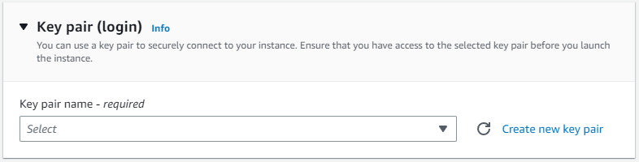
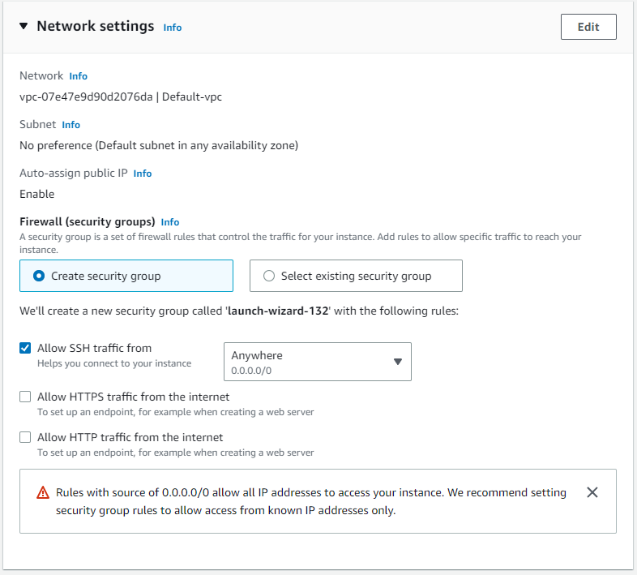
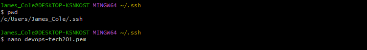
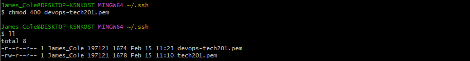
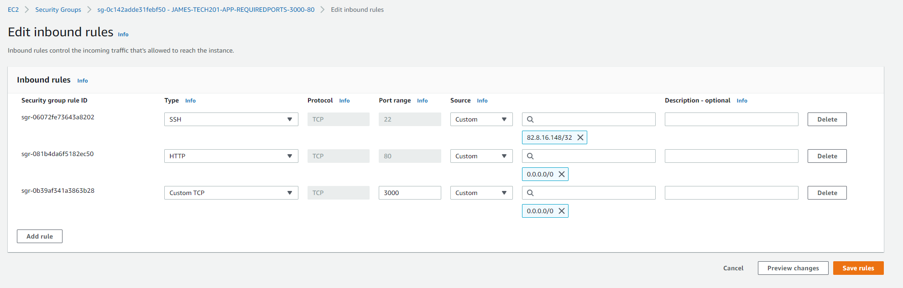

# Setting up AWS

## Opening AWS

make sure region is ireland or whichever is necassry for this instance as it is regionally specific.

## Starting AWS instance

Navigate to EC2 from ireland then launch a new instance.



scroll down to Application and OS image. change this to ubuntu 18.04, leave options on default



Select the key pair for this instance, or create a new key pair. The key should be in the .ssh folder.



Change Network Settings



When ready launch the instance.

## Starting AWS instance on GitBash

If, for some reason the .pem key pair cannot be copied into the ssh folder, another can be made by making the file there and using nano to copy and paste a key into it. Make sure there are no spaces at the beginning or end of the text and you should be inside your .ssh file.

$ `nano devops-tech201.pem`



## Setup on Gitbash

Then do this, where chmod means to change the permissions , 400 means read only (0 for other permissions) and then our file name at the end.

$ `chmod 400 devops-tech201.pem`



Now we have to get a line from our AWS console to complete the next step. by clicking on our instance in the list of instances and then connect, this line should be generated for us.


use this line in the GitBash terminal next

$ `ssh -i "devops-tech201.pem" ubuntu@ec2-3-252-250-105.eu-west-1.compute.amazonaws.com`

## Update and Install nginx

`sudo apt-get update -y` 

`sudo apt-get install nginx -y`

## Migrating files to AWS

We can use the SCP command 

`scp -i devops-tech201.pem -r C:\Users\James_Cole\.vscode\tech201_virtualisation\tech201_virtualisation\app ubuntu@ec2-34-248-205-55.eu-west-1.compute.amazonaws.com:/home/ubuntu`

This line has to be written in the .ssh folder on your pc to connect to the remote host.

after this we must connect to our AWS and navigate to the app file such as `ubuntu@ip-172-31-21-5:~/app$`.

Then run the following:

`sudo apt install npm`

`node app.js`

## Running the app and setting up the reverse proxy

Navigate to your IP address in EC2 Instance connect from the AWS website. by going to the :3000 port your app should now be working however, It will not work by reverse proxy unless it has been configured this way.

If the provision file is not working then the instructions must by typed manually into ubuntu@ip-172-31-21-5:~/app$ .

```
sudo apt-get update -y
sudo apt-get upgrade -y

# Install Nginx
sudo apt-get install nginx -y
#sudo systemctl start nginx 
sudo systemctl enable nginx -y

# install python
#sudo apt-get install python -y

# Remove default nginx configuration
sudo rm /etc/nginx/sites-available/default

# Copy the reverse proxy file containing the relevant code into that location
sudo cp app/reverse_proxy /etc/nginx/sites-available/default

# Restart nginx to confirm changes
sudo systemctl restart nginx -y

# enable the changes to nginx
#sudo systemctl enable nginx -y

sudo apt-get install python-software-properties

# Overwrite with desired version of nodejs
curl -sL https://deb.nodesource.com/setup_12.x | sudo -E bash -

# Install nodejs
sudo apt-get install nodejs -y

# Install pm2
sudo npm install pm2 -g

##
# Install app
cd app; npm install
# Seed the Database


# Environmental vabriable

echo 'export DB_HOST=mongodb://192.168.10.150:27017/posts' >> ~/.bashrc 
source .bashrc

# Enable reverse proxy
sudo systemctl restart nginx 

node seeds/seed.js
```

It will likely now be necessary to kill the port connection at 3000 and reset:

`sudo lsof -i :3000`

will list the processes active at port 3000

`kill -9 number`

Insert the number where number is written for the port (PID).


## Troubleshooting

### Ip address change

This could result in a timeout from an ssh request



