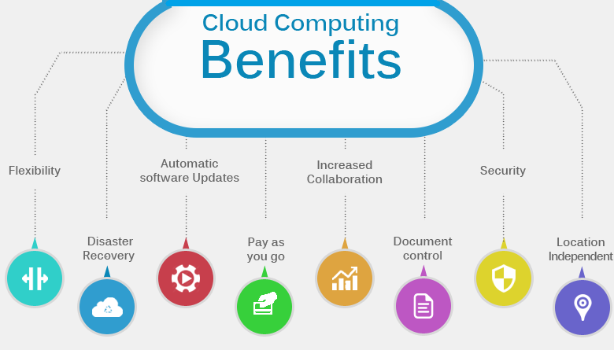

# Cloud_computing_AWS
Cloud_computing_AWS

## What is cloud computing

fundamentally cloud computing is the on demand availability of computing resources without the maintainance of necessary hardware for the end user. In particular, data storage  where the proportion stored on he cloud has grown to 60% of corporate data by 2022 and is still rapidly increasing.
A cloud functions by keeping its data in large centralised datacenters and connecting with end users to provide this data on demand in  a secure manner. Organizations of every type, size, and industry are using the cloud for a wide variety of use cases, such as data backup, disaster recovery, email, virtual desktops, software development and testing, big data analytics, and customer-facing web applications.

## History of cloud computing

here we have the history of cloud computing from the 1960s to today , like many computing concepts it has been in development for decades before its popularity with IBM offering time sharing of computers with remote job entry in the 1960s. these datacenters and services became better over time but had limited use.
in the `1990s virtual private networks were developed by telecoms companies to use bandwidth more effectively and the internet was popularised opening cloud computing up to new markets.
more recently the most populare cloud services such as aws in 2002 and azure in 2010 have seen cloud computing sckyrocket in use with most corporate data being on the cloud since 2020 and the proportion continuing to increase rapidly.

## What are the benefits of cloud computing

There are many benefits to cloud computing including Business continuaty, Scalabiliy , Cost, Easier Collabertion, Faster Backups and Prevention of Data loss.

## What are the benefits of cloud computing for business

## what is AWS

## History of AWS

## Who are some of the other leaders in Cloud technology

## What are the different types of cloud (public,private,hybrid)

## What types of industry use each type of cloud and Why?

## What are the different types of Cloud service (IaaS, Paas, Saas)

## Differeces between different types of Cloud service

## Operating expenditure vs Capital expenditure (OpEx vs CapEx)

## Examples of companies that use the cloud - and what for

## Summary

