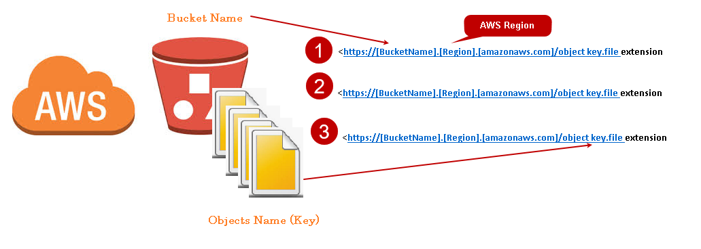

# Simple Storage Service (S3)

S3 buckets are a cost effective way of maintaining availability of content. They are commonly used in social media sites. These buckets have many advantages such  as scalability, availability, security and performance.

They can be used to backup, host static websites and file sharing.

CRUD
- create
- read
- update
- delete
- upload
- download

## S3 Buckets

A bucket is a container of objects stored in S3. Every object is contained in a bucket, these need a region and URL. You can use Amazon S3 API's to manage buckets.

## Creating the S3 Bucket

Firstly you need a pair of keys, the Access key ID and the Secret Access keys. A new Instance must be created, use the same security profile as normal and start an instance in the way explained in LaunchingAWS, the usal .pem file can be used from the .ssh folder.

Once this is completed you can simply enter your instance in GitBash using the line from the connect tab on your running instance.

Now the following commands can be entered.

`sudo apt-get update -y`

`sudo apt upgrade -y`

`sudo apt upgrade -y`

Python must also be installed for AWS S3 buckets to work as it relies on this for dependancies.

`sudo apt install python -y`

However this will install 2.7, you can check with the following. If required install python 3.

`python --version`

`sudo apt install python3-pip`

Finally ,

`sudo pip3 install awscli`

Now this bucket is set up and ready to configure

`aws configure`

Here it will ask for the two keys , followed by the region and output format type which should be the same region as your instance and JSON. Then make the bucket.

`aws s3 mb s3://james-tech201`

We can confirm this by checking the files.

`aws s3 ls`

Now if we want to add a text file we can use the follwing.

`sudo touch text.txt`

and edit it with 

`sudo nano text.txt`

By navigating to s3 and finding your bucket, you will also be able to find this file.

