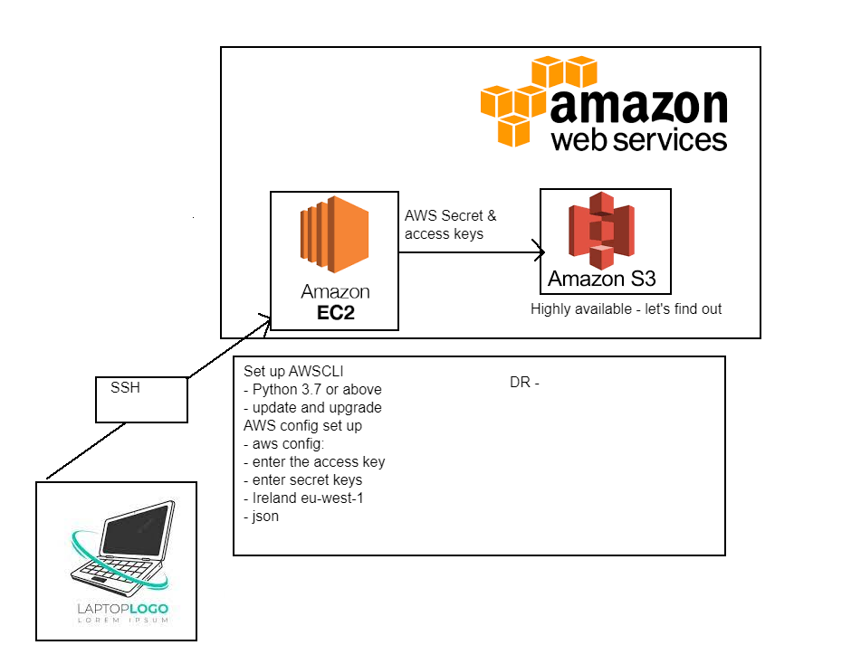

# Simple Storage Service (S3)

S3 buckets are a cost effective way of maintaining availability of content. They are commonly used in social media sites. These buckets have many advantages such  as scalability, availability, security and performance.

They can be used to backup, host static websites and file sharing.

CRUD
- create
- read
- update
- delete
- upload
- download


## S3 Buckets

A bucket is a container of objects stored in S3. Every object is contained in a bucket, these need a region and URL. You can use Amazon S3 API's to manage buckets.

## Creating the S3 Bucket

Firstly you need a pair of keys, the Access key ID and the Secret Access keys. A new Instance must be created, use the same security profile as normal and start an instance in the way explained in LaunchingAWS, the usal .pem file can be used from the .ssh folder.

Once this is completed you can simply enter your instance in GitBash using the line from the connect tab on your running instance.



Now the following commands can be entered.

`sudo apt-get update -y`


`sudo apt upgrade -y`


`sudo apt upgrade -y`

Python must also be installed for AWS S3 buckets to work as it relies on this for dependancies.

`sudo apt install python -y`

However this will install 2.7, you can check with the following. If required install python 3.

`python --version`

`sudo apt install python3-pip`

Finally ,

`sudo pip3 install awscli`

Now this bucket is set up and ready to configure

`aws configure`

Here it will ask for the two keys , followed by the region and output format type which should be the same region as your instance and JSON. Then make the bucket.

`aws s3 mb s3://james-tech201`

We can confirm this by checking the files.

`aws s3 ls`

Now if we want to add a text file we can use the follwing.

`sudo touch text.txt`

and edit it with 

`sudo nano text.txt`

By navigating to s3 and finding your bucket, you will also be able to find this file in your bucket instantce.

we can use the following command to sync our bucket with the one on AWs console, if we don't have files on our local system

`aws s3 sync s3://james-tech201 .`

The point at the end can be changed for the specific file. The cp copy command can be used for the same purpose.

`aws s3 cp s3://mybucket/test.txt new_file_name.txt`

To remove the data from the bucket.

`aws s3 rm s3://james-tech201/test.txt`

To remove the bucket the following command line can be used

`aws s3 rb s3://james-tech201`

## Python Scripts

Use the following to install boto3

`pip3 install boto3`

This should confirm that boto3 is downloaded

`pip3 show boto3`

Now We can write a python file for the config and run it.

`sudo touch file.py`

Once we have created the file, it can now be filled with the relevant code to start our bucket.

`sudo nano file.py`

The os module should also be imported in the python file.

`import os`

```
import boto3 
s3 = boto3.resource('s3')
s3.create_bucket(Bucket='james-tech201-python', CreateBucketConfiguration={'LocationConstraint': 'eu-west-1'}) 
bucket = s3.Bucket('james-tech201-python')
bucket.upload_file('C:/Users/James_Cole/.ssh/test1.txt', 'test1.txt') 
bucket.download_file('test1.txt', 'C:/Users/James_Cole/.ssh/test1.txt') 
bucket.Object('test1.txt').delete() 
s3.Bucket('james-tech201-python').delete()
```

To run the python file use this line. This should automatically create our bucket, transfer a file and then delete it.

`python3 file.py`


