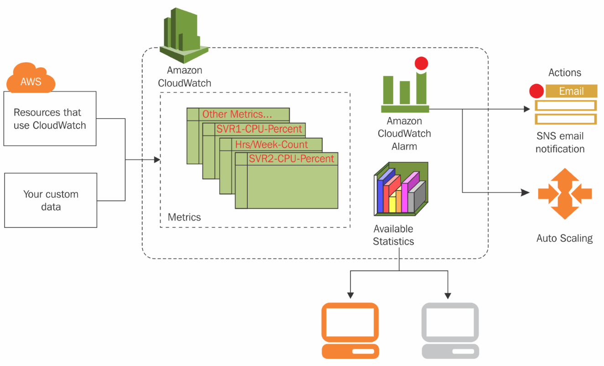
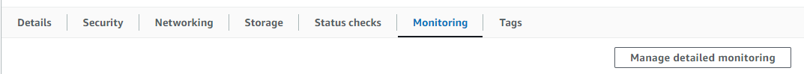

# Setting up the alarm in AWS

You can set up an alarm to trigger when usage goes above a certain threshold percentage in the types of uses that AWS offers in its inbuilt alarms. The outline of this is displayed below with potential for autscaling actions and email notificaions.

This following documentation will be useful for setting up our alarm.

https://docs.aws.amazon.com/AmazonCloudWatch/latest/monitoring/US_AlarmAtThresholdEC2.html

Firstly got to the monitoring in the EC2 dashboard and tick the enable box for the deatailed monitoring.

Now navigate to Amazon cloudwatchdashboard and go to the alarms tab, select all alarms and then create alarm.

Your email should be the communication endpoint. 

You should now recieve an email saying your alarm is set up.
