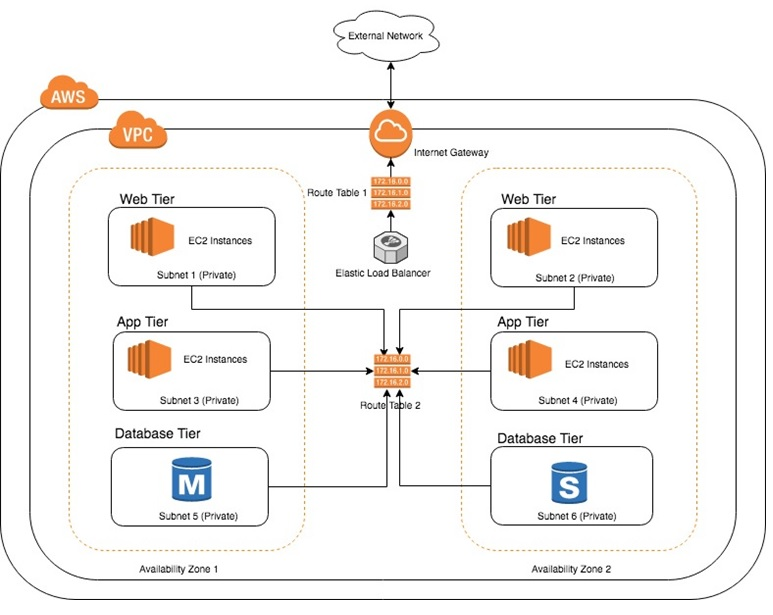
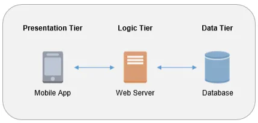

# Creating a 2-tier architecture

Two tier architecture should be created on the AWS cloud with two servers deployed on Elastic Compute Cloud (EC2) Instances.

## Why do we need to make a 2-tier architecture ?

We need to make 2-tier architecture due to the risk of the monolith architecture failing and being completely unaccessable, users should still be able to access the app and be redirected to another page in the case of database failure. It also provieds security by keeping the data seperate from the app greater performance reliability and cost reduction.

## Why do we need to refactor a monolithic  architecture into a 2-tier?

Refactoring our monolithic architecture into two tiers is necassery to keep the application and database seperate and so these can function independantly, one does not disable the other.

## Why did we do it on the cloud?

Building two tier architecture on the cloud delivers all of the other benefits of hosting on the cloud.

## How does this fit into DevOps?

Devops is about improving our software in parallel , by having seperate components that can work independantly, Devops teams can improve the app without worrying about compromising functionality.

## How does this fit into agile/ SCRUM?

Having more than one tier allows improvemnts in smaller increments which is more in keeping with the scrum principles than monolithic which may have single larger releases.

## Security Rules

## Requirements for Two Tier architecture

- app tier deployed and available on port 3000
- create second tier dependancies using ubuntu 18.04LT Mongodb
- Installed and Config changed for mongod.conf 0.0.0.0
-Security group for the database allows 27017 from anywhere 
- Create an env var in app instance with database endpoint
- Database is exposed only to the app
- Relaunch the app

## Starting Mongodb

Navigate to the `.ssh` directory in your pc.

change directory to enter your database vm, you should be able to find the example command after connecting your database virtual machine on the EC2 Console, the code here should be changed to have the correct address. 

`ssh -i "devops-tech201.pem" ubuntu@ec2-34-248-23-204.eu-west-1.compute.amazonaws.com`

Run the following code to ensure access to the internet.

`sudo apt-get update -y`

Now we have to do the data migration, the easiest way to do this is to get our repository URL and use the clone command

`git clone URL`

Now we will have to navigate to the correct forlder with the provision file with the script ls, cd

use the following commands to reach the correct provision.sh file.

`cd`
`ls`

To avoid automatic configuration, use `#` to disable the mongod config lines in `provison.sh`

`sudo nano provision.sh`

change the permissions with the following command to ensure that the provision file is read only

`chmod 400 provision.sh`

Then we have to .ssh in to our instance

`ssh -i "devops-tech201.pem" ubuntu@ec2-34-248-23-204.eu-west-1.compute.amazonaws.com`

`sudo apt-get update-y`

`sudo apt-get upgrade -y`

`sudo agt-get install nginx -y`

The I.P address should now show the nginx homepage.

## Migration and running the app

