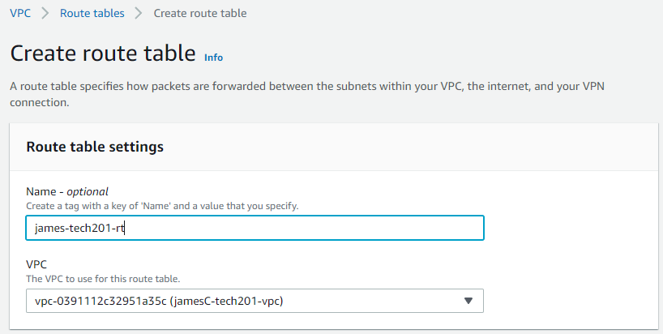

# Virtual Private Cloud


## How does the VPC help Devops

- keeps instances private, good for instances that should not be connected to the internet.

## Virtual private cloud
virtual private clouds are a pool of shared rescources allocated within a public cloud environment. You can add subnets to this virtual private cloud which is a range of IP addresses in your VPC.

- You can create any number of subnets, though you cannot overlap them within the same VPC

- You can assign IPv4 addresses and IPv6 addresses to your VPCs and subnets. 

- route tables can be used to determine where network traffic from your subnet or gateway is directed.

- A gateway connects your VPC to another network. For example, use an internet gateway to connect your VPC to the internet. 

- The VPC endpoint to connect to AWS services privately, without the use of an internet gateway or NAT device.

- Use a VPC peering connection to route traffic between the resources in two VPCs.

- Copy network traffic from network interfaces and send it to security and monitoring appliances for deep packet inspection.

- Use a transit gateway, which acts as a central hub, to route traffic between your VPCs, VPN connections, and AWS Direct Connect connections.

- A flow log captures information about the IP traffic going to and from network interfaces in your VPC.

- Connect your VPCs to your on-premises networks using AWS Virtual Private Network (AWS VPN).

## CIDR
- Classless inter-domain routing (CIDR) is a method for allocating IP addresses and IP routing. 
- A collection of Internet Protocol (IP) standards is used to create unique identifiers for networks and individual devices. 
- The IP addresses allow the transmission of unique packets of information to specific computers.

- CIDR is mainly used to use IP addresses and solve the routing table explosion efficiently. 
- It is defined in RFC (Request for comments) 1518 and RFC 4632. It is an address block allocation. 
- There are five different classes in the IPV4 addressing system. The IP address classes are used for Internet IP addresses assignment.

## What is an Internet gateway

- A gateway connects networks, while a router typically delivers data within a network. 
- Historically, gateways and routers have been separate devices. However, it's becoming more common for their functions to be combined and simply called a router. 
- For example, the Wi-Fi routers commonly provided for home and small business internet service are both a router (delivering data) and a gateway (translating it so destination devices can use it).

## Creating the VPC, Internet gateway subway and route table.

1. Create a Vpc
2. Create an IG
3. Attach IG to VPC
4. Allow internet Access(0.0.0.0.0)
5. Create a public subnet
6. Associate subnet with VPC
7. create a Route table RT
8. Add rules to Route table and atach to public subnet
9. Edit route table to IG

CIDR blocks  that can be used 10.0.0.0/16
An online calcualtor can find IP range. Note that this process may take trial and error since many IP addresses may be taken.

https://mxtoolbox.com/SubnetCalculator.aspx


auto assign public ip enable

## Creating the VPC walkthrough

### Create VPC
Firstly navigate to VPC in aws and click create VPC, here choose the following options,
- VPC only
- name tag - as the naming convention, name, group, vpc
- IPv4 use 10.0.0.0/16
- No IPv6 CIDR block
This VPC can now be created


### Create Public Subnet
Navigate to VPC and click on subnets, create subnet. Select the following options.
- name tag - name-group-public-app
- enter a IPv4 CIDR within the range that is not taken
This is now ready to be Created


### Creating the internet gateway

Click on internet gateways and Create new internet gateway.
- name it as per naming convention name-group-ig
- This can now be created and select the action to attach to your vpc afterwards


### Creating the route table for the public subnet
Click on create route table from the route tables section.
- name it as per convention name -group -public-rt




This route table can now be selected and and the subnet associations edited.
- go to edit subnet associations and select your public subnet then save
- got to edit routes in routes and add route, enter 0.0.0.0/0
- select your internet gateway in internet gateway and save changes


### Creating the private subnet

Navigate to VPC and click on subnets, create subnet. Select the following options, the same as the one for the public subnet.
- name tag - name-group-private-db
- enter a IPv4 CIDR within the range that is not taken
This is now ready to be Created

### Create the private subnet route table

Click on create route table from the route tables section.
- name it as per convention name-group-private-rt

This route table can now be selected and and the subnet associations edited.
- go to edit subnet associations and select your private subnet then save


### Creating the security group for App and launching

Firstly go back to EC2 now that route tables, VPC, subnet and internet gateways have all been setup.

- launch instance, use naming convention name-group-app-vpc
- select the app AMI
- select the same key you have been using


Change the network settings to create the security group

- select your vpc and your public subnet 
- auto assign IP should be enabled
- Security rule 1 port 22, ssh, my IP
- Security rule 2 port 3000, anywhere
- Security rule 3 port 80, HTTP, anywhere
- name security group name-group-app-public

Your instance is now ready to launch, click launch.


### Creating the security group for database and launching

This is very similar to the first instance.

- launch instance, use naming convention name-group-db-vpc
- select the db AMI
- select the same key you have been using


Change the network settings to create the security group

- select your vpc and your private subnet 
- auto assign IP should be DISABLED
- Security rule 1 port 22, ssh, my IP
- Security rule 2 port 27017, anywhere
- name security group name-group-db-public

Your instance is now ready to launch, click launch.

### Check that your VPC is correctly set up

you can do this by navigating to vpc and looking at the resource map, it should show all of your subnets and route maps which can have their associated subnets , routes and IPs examined and modified by hovering over and clicking on them. You can use this to help with troubleshooting.


### Enter your App instance and Launch

You can use gitbash to navigate to

`cd .ssh`

then use the command in the connect section of your app instance , make sure it says ubuntu and not root.

`ssh -i "devops-tech201.pem" ubuntu@54.229.243.47`

Once inside, use the following commands

```
export DB_HOST=mongodb://10.0.8.93:27017/posts
cd app # or where your app.js is located
npm start
node seeds/seed.js
node app.js
```

To check that your app is working:

```

export DB_HOST=
cd app # or where your app.js is located
npm start
node app.js

```


